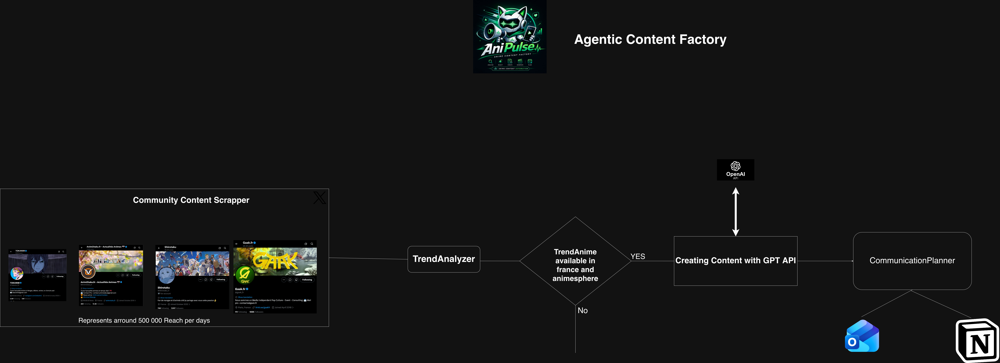

# AniPulse

AniPulse is an agentic content factory built for AnimeSphere.

It turns anime community signals into a validated editorial pipeline: it monitors X/Twitter influencer accounts, detects trending anime, checks that each anime exists on AnimeSphere, generates platform-specific content with OpenAI, schedules it in Notion, and sends a Resend email recap.

AniPulse does not auto-post on social platforms. It creates drafts and calendar items with a human validation step.



## Why

AnimeSphere needs repeatable acquisition channels around anime discovery and seasonal anime trends. Manually monitoring the community, choosing relevant titles, writing posts, planning publication slots, and sending recap notes is time-consuming.

AniPulse compresses that workflow into one daily agent run.

## MVP Scope

The hackathon MVP covers the full content-planning loop:

1. Collect tweets from selected anime influencer accounts over the last 24 hours.
2. Detect candidate anime titles from a configurable watchlist.
3. Verify that the anime exists on AnimeSphere through the public search endpoint.
4. Rank candidates using community engagement and fan/react signals.
5. Generate four content drafts per run:
   - two X/Twitter react posts;
   - one SEO article draft;
   - one TikTok script.
6. Create one Notion calendar item per generated content draft.
7. Send a Resend email recap.
8. Export JSON and Markdown backup files.

## Architecture

AniPulse is organized as a simple Python pipeline:

- **Community Content Scraper**: fetches recent tweets from influencer accounts through the X API.
- **TrendAnalyzer**: scores tweets using engagement, media count, fan/react vocabulary, and AnimeSphere availability.
- **AnimeSphere lookup**: checks the public AnimeSphere API before generating content.
- **OpenAI generation**: writes platform-specific drafts with a fan/community tone.
- **CommunicationPlanner**: schedules content into Notion with platform tags, dates, validation status, AnimeSphere links, and source tweet links.
- **Resend digest**: sends a summary email after each run.

The default influencer watchlist is:

```env
X_ACCOUNTS=shirotaku_fr,Tokanim_FR,gaak_fr,animotaku_fr
```

In the last measured 24h window, these accounts represented about **499,000 cumulative impressions** across 30 tweets.

## Installation

```bash
python3 -m venv .venv
source .venv/bin/activate
pip install -e .
cp .env.example .env
```

## Configuration

Secrets stay in `.env`.

Required for the full workflow:

- `X_API_TOKEN`: X API bearer token.
- `OPENAI_API_KEY`: enables content generation.
- `NOTION_TOKEN`: Notion integration token.
- `NOTION_CONTENT_CALENDAR_DB_ID`: Notion database used as the planning calendar.
- `RESEND_API_KEY`: enables the email recap.
- `RESEND_FROM_EMAIL`: sender email.
- `RESEND_TO_EMAIL`: recipient email.

Useful runtime variables:

- `ANIPULSE_SOURCE`: `sample` or `x-api`.
- `ANIPULSE_DAILY_LIMIT`: number of drafts to generate per run.
- `X_ACCOUNTS`: comma-separated influencer accounts.
- `X_LOOKBACK_HOURS`: tweet collection window, default `24`.
- `ANIPULSE_TRACKED_TITLES`: comma-separated anime titles to detect in tweets.
- `NOTION_FALLBACK_PAGE_ID`: fallback parent page if the Notion database is unavailable.

## Run Locally

Full local workflow:

```bash
ANIPULSE_SOURCE=x-api anipulse --write --limit 4 --export-dir exports
```

This command runs:

```text
X API -> Trend analysis -> AnimeSphere lookup -> OpenAI generation -> Notion planning -> Resend email -> JSON/Markdown exports
```

Dry-run without external writes:

```bash
ANIPULSE_SOURCE=x-api anipulse --dry-run --json
```

Fallback sample mode:

```bash
anipulse --dry-run --json
```

Email-only test without creating new Notion events:

```bash
anipulse --send-email --skip-notion --limit 4 --export-dir exports
```

## Daily Automation

GitHub Actions workflow:

```text
.github/workflows/anipulse-daily.yml
```

It runs every day at **08:30 Europe/Paris** (`06:30 UTC`) and executes:

```bash
anipulse --write --export-dir exports
```

GitHub secrets required:

- `X_API_TOKEN`
- `OPENAI_API_KEY`
- `NOTION_TOKEN`
- `NOTION_CONTENT_CALENDAR_DB_ID`
- `RESEND_API_KEY`

GitHub variables required:

- `ANIPULSE_DRY_RUN=false`
- `NOTION_FALLBACK_PAGE_ID`
- `RESEND_FROM_EMAIL`
- `RESEND_TO_EMAIL`

## Demo Flow

1. Show influencer accounts as the community signal source.
2. Run the local command or show the latest successful run.
3. Open the generated Notion items in `Planning AniPulse`.
4. Show platform tags: `X / Twitter`, `SEO`, `TikTok`.
5. Show the AnimeSphere URL and the source tweet URL.
6. Show the Resend recap email.

## Current Limitations

- No social auto-posting yet.
- Anime title detection uses a configurable watchlist, not full NLP entity extraction.
- Visual extraction is limited to metadata and source links.
- Video generation through Hermes/OpenClaw is a next step, not part of this MVP.

## Next Steps

- Add duplicate prevention across daily runs.
- Add richer title/entity extraction for anime names.
- Add video brief generation for Hermes/OpenClaw.
- Add per-platform performance feedback loops.
